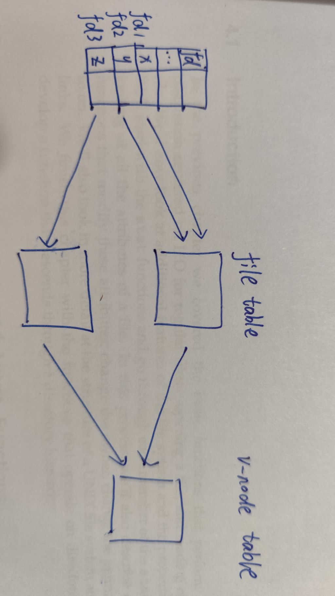

3_6_1.c
```c
#include <unistd.h>
#include <stdio.h>
#include <stdlib.h>

int main(void)
{
    if (-1 == lseek(STDIN_FILENO, 0, SEEK_CUR))
    {
        perror("can not seek");
    }
    else
    {
        printf("seek ok\n");
    }

    exit(0);
}
```
```
myx@myx-virtual-machine:~/myFiles/APUE/Chapter-03$ ./3_6_1.out < /etc/passwd
seek ok
myx@myx-virtual-machine:~/myFiles/APUE/Chapter-03$ cat /etc/passwd | ./3_6_1.out 
can not seek: Illegal seek
```

3_6_2.c
```c
#include <stdio.h>
#include <fcntl.h>
#include <stdlib.h>
#include <unistd.h>

char g_buf_1[] = "abcdefghij";
char g_buf_2[] = "ABCDEFGHIJ";

int main(void)
{
    int i_fd;

    if ((i_fd = open("file.hole", O_RDWR | O_CREAT | O_TRUNC, 0744)) < 0)
    {
        perror("open file.hole failed");
        goto fail1;
    }

    if (10 != write(i_fd, g_buf_1, 10))
    {
        perror("write 1 failed");
        goto fail2;
    }

    if (-1 == lseek(i_fd, 16384, SEEK_SET))
    {
        perror("lseek failed");
        goto fail2;
    }

    if (10 != write(i_fd, g_buf_2, 10))
    {
        perror("write 2 failed");
        goto fail2;
    }

    close(i_fd);
    exit(0);

fail2:
    close(i_fd);
fail1:
    exit(-1);
}
```
```
/* 使用dd创建非空洞文件 */
myx@myx-virtual-machine:~/myFiles/APUE/Chapter-03$ dd if=/dev/urandom of=file.nohole bs=16394 count=1
记录了1+0 的读入
记录了1+0 的写出
16394字节（16 kB，16 KiB）已复制，0.000515164 s，31.8 MB/s
myx@myx-virtual-machine:~/myFiles/APUE/Chapter-03$ ls -l
总用量 69
-rwxrwxrwx 1 root root   234 7月   3 23:44 3_6_1.c
-rwxrwxrwx 1 root root 16824 7月   4 22:30 3_6_1.out
-rwxrwxrwx 1 root root   722 7月   4 22:31 3_6_2.c
-rwxrwxrwx 1 root root 17000 7月   4 22:31 3_6_2.out
-rwxrwxrwx 1 root root 16394 7月   4 22:53 file.hole
-rwxrwxrwx 1 root root 16394 7月   4 23:00 file.nohole
-rwxrwxrwx 1 root root   160 7月   4 22:30 Makefile
-rwxrwxrwx 1 root root   453 7月   3 23:46 README.md
myx@myx-virtual-machine:~/myFiles/APUE/Chapter-03$ du -h file.*
17K     file.hole
17K     file.nohole
```
我的电脑，空洞文件大小和非空洞的一样，现在没理解为啥
```
myx@myx-virtual-machine:~/myFiles/APUE/Chapter-03$ uname -a
Linux myx-virtual-machine 5.4.0-187-generic #207-Ubuntu SMP Mon Jun 10 08:16:10 UTC 2024 x86_64 x86_64 x86_64 GNU/Linux
```

3_9_1.c
```c
#include <unistd.h>
#include <stdio.h>
#include <stdlib.h>

#define BUF_SIZE 8192

int main(void)
{
    int n;
    char buf[BUF_SIZE];

    while ((n = read(STDIN_FILENO, buf, BUF_SIZE)) > 0)
    {
        if (write(STDOUT_FILENO, buf, n) != n)
        {
            perror("write failed");
        }
    }

    if (n < 0)
    {
        perror("read err");
    }

    exit(0);
}
```

测试了几种情况，测试文件大小为```-rwxrwxrwx 1 root root 10485760 7月   4 23:42 iotest.file```
|BUF_SIZE|real|user|sys|
|:---:|:---:|:---:|:---:|
|1|0m14.256s|0m5.152s|0m9.100s|
|128|0m0.128s|0m0.049s|0m0.078s|
|4096|0m0.025s|0m0.011s|0m0.000s|
|8192|0m0.029s|0m0.011s|0m0.000s|

3_14_1.c
```c
#include <fcntl.h>
#include <stdio.h>
#include <unistd.h>
#include <stdlib.h>

int main(int argc, char *argv[])
{
    int val;

    if (argc != 2)
    {
        printf("Usage: ./3_14_1.out <file>\n");
        return -1;
    }

    if ((val = fcntl(atoi(argv[1]), F_GETFL, 0)) < 0)
    {
        perror("fcntl failed");
        return -1;
    }

    switch (val & O_ACCMODE)
    {
        case O_RDONLY:
            printf("read only");
            break;
        case O_WRONLY:
            printf("write only");
            break;
        case O_RDWR:
            printf("read write");
            break;
        default:
            printf("unkown");
            break;
    }

    if (val & O_APPEND)
    {
        printf(", APPEND");
    }

    if (val & O_NONBLOCK)
    {
        printf(", NONBLOCK");
    }

    if (val & O_SYNC)
    {
        printf(", SYNC");
    }

#if !defined(_POSIX_C_SOURCE) && defined(O_FSYNC) && (O_SYNC != O_FSYNC)
    if (val & O_FSYNC)
    {
        printf(", FSYNC");
    }
#endif

    putchar('\n');
    exit(0);
}
```
```
myx@myx-virtual-machine:~/myFiles/APUE/Chapter-03$ ls -l /dev/tty temp.foo
crw-rw-rw- 1 root tty  5, 0 7月   7 15:59 /dev/tty
-rwxrwxrwx 1 root root   11 7月   7 17:30 temp.foo
myx@myx-virtual-machine:~/myFiles/APUE/Chapter-03$ ./3_14_1.out 0 < /dev/tty
read only
myx@myx-virtual-machine:~/myFiles/APUE/Chapter-03$ ./3_14_1.out 1 > temp.foo
myx@myx-virtual-machine:~/myFiles/APUE/Chapter-03$ cat temp.foo 
write only
myx@myx-virtual-machine:~/myFiles/APUE/Chapter-03$ ./3_14_1.out 2 2>>temp.foo
write only, APPEND
myx@myx-virtual-machine:~/myFiles/APUE/Chapter-03$ ./3_14_1.out 5 5<>temp.foo
read write
```

练习
3.1
这里的unbuffered I/O指每次都调用系统调用，但是在实际写入文件之前，内核或者文件系统还是有buffer的

3.2
//TODO 暂时不清楚，怎么原子实现关闭+复制

3.3

F_SETFD修改文件描述符标志位，每个fd有自己的
F_SETFL修改文件状态标志位，在file table中，多个fd1 fd2的共享
测试如[p3.3](p3_3.c)
```
myx@myx-virtual-machine:~/myFiles/APUE/Chapter-03$ ./p3_3.out 
original
fd1_fdf:0 fd1_fsf:32770
fd2_fdf:0 fd2_fsf:32770
fd3_fdf:0 fd3_fsf:32768
after modify fd1 fdf
fd1_fdf:1 fd1_fsf:32770
fd2_fdf:0 fd2_fsf:32770
fd3_fdf:0 fd3_fsf:32768
after modify fd1 fsf
fd1_fdf:1 fd1_fsf:33794
fd2_fdf:0 fd2_fsf:33794
fd3_fdf:0 fd3_fsf:32768
```

3.4
int dup2(int oldfd, int newfd);
如果fd是1，执行完后，0 1 2 都指向1的file table
如果fd是3，执行完后，0 1 2 都指向3的file table，而且3自己也指向这个file table，这里的if就是为了关闭这个多的fd吧

3.5
这里以这个函数为例
```c
#include <unistd.h>
#include <stdlib.h>

int main(void)
{
    write(STDOUT_FILENO, "test test\n", 10);
    write(STDERR_FILENO, "test err\n", 9);
    exit(0);
}
```
```
myx@myx-virtual-machine:~/myFiles/APUE/Chapter-03$ ./p3_5.out > outfile 2>&1
myx@myx-virtual-machine:~/myFiles/APUE/Chapter-03$ cat outfile 
test test
test err
myx@myx-virtual-machine:~/myFiles/APUE/Chapter-03$ rm outfile 
myx@myx-virtual-machine:~/myFiles/APUE/Chapter-03$ ./p3_5.out 2>&1 > outfile
test err
myx@myx-virtual-machine:~/myFiles/APUE/Chapter-03$ cat outfile 
test test

默认情况，stdout和stderr都指向shell，
第一个，先把STDOUT_FILENO指向outfile的file table，再把STDERR_FILENO指向STDOUT_FILENO指向的file table，最终STDOUT_FILENO和STDERR_FILENO都指向了outfile
第二个，先把STDERR_FILENO指向STDOUT_FILENO指向的file table，再把STDOUT_FILENO指向outfile的file table，因此err的打印打在shell里，stdout的打印打到outfile
```
3.6
先lseek，再read，是可以的
但是O_APPEND的作用是每次write前先lessk到文件末尾，再write，所以不能lseek再修改以及存在的数据
```c
#include <unistd.h>
#include <stdlib.h>
#include <fcntl.h>
#include <stdio.h>

int main()
{
    int fd;
    off_t lseek_offset;
    char buf[1024] = {0};
    int read_len;

    if ((fd = open("testfile", O_RDWR | O_APPEND)) < 0)
    {
        perror("open failed 1");
        exit(-1);
    }

    if((lseek_offset = lseek(fd, 4, SEEK_SET)) != 4)
    {
        perror("lseek err 1");
        exit(-1);
    }

    if ((read_len = read(fd, buf, 1)) < 0)
    {
        perror("read fail");
        exit(-1);
    }

    if (write(STDOUT_FILENO, buf, 1) != 1)
    {
        perror("write fail 1");
        exit(-1);
    }
    putchar('\n');

    if((lseek_offset = lseek(fd, 5, SEEK_SET)) != 5)
    {
        perror("lseek err 2");
        exit(-1);
    }

    if ((write(fd, "x", 1)) != 1)
    {
        perror("write fail 2");
        exit(-1);
    }

    exit(0);
}
```
```
myx@myx-virtual-machine:~/myFiles/APUE/Chapter-03$ cat testfile 
0123456789myx@myx-virtual-machine:~/myFiles/APUE/Chapter-03$ ./p3_6.out 
4
myx@myx-virtual-machine:~/myFiles/APUE/Chapter-03$ cat testfile 
0123456789xmyx@myx-virtual-machine:~/myFiles/APUE/Chapter-03$ 
```